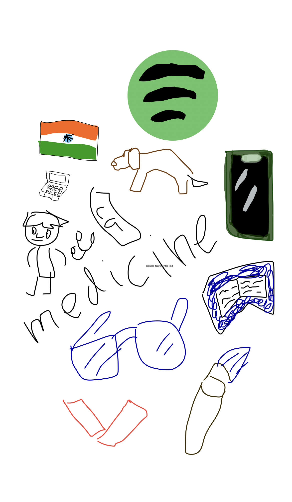

## Aashrays Blog 
I am Aashray. I am taking csp so i can code code code. I enjoy music, games, science, and math. I hope to learn a lot from this class.  

This will be my blog/website

## What I hope to learn from CSP

I hope to learn how to code some advanced algorithims, and also understand multiple coding languages. I already know some basics of Python , and HTML. I would like to implement a way to mix biology and computer science which are my two favorite subjects. 

## My Favorite things

My Fabvorite Album: Utopia

My Favorite Food: Ramen

More things to be Added

## Blog Frequency

I hope to blog everytime a major update is made, so that I can keep proper track of my assignments, and changes that I make. 